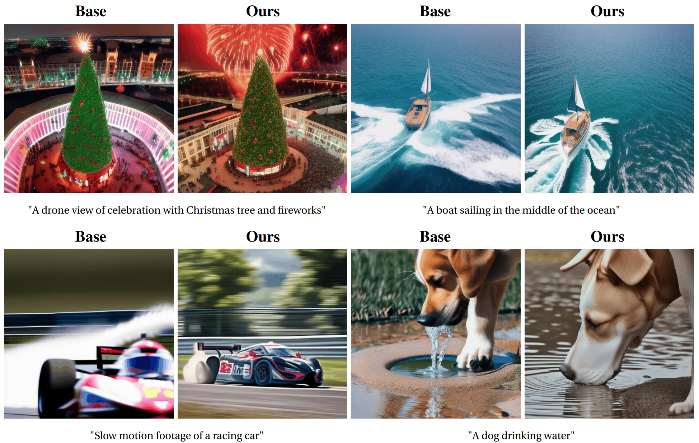

# VideoGuide: Improving Video Diffusion Models without Training Through a Teacher's Guide

This repository is the official implementation of [VideoGuide: Improving Video Diffusion Models without Training Through a Teacher's Guide](https://arxiv.org/abs/2410.04364), led by

[Dohun Lee*](https://github.com/DoHunLee1), [Bryan S Kim*](https://scholar.google.com/citations?user=ndWU-84AAAAJ&hl=en), [Geon Yeong Park](https://geonyeong-park.github.io/), [Jong Chul Ye](https://bispl.weebly.com/professor.html)



[](https://dohunlee1.github.io/videoguide.github.io/)
[](https://arxiv.org/abs/2410.04364)

---
## 🔥 Summary

**VideoGuide** 🚀 enhances temporal quality in video diffusion models *without additional training or fine-tuning* by leveraging a pretrained model as a guide. During inference, it uses a guiding model to provide a temporally consistent sample, which is interpolated with the sampling model's output to improve consistency. VideoGuide shows the following advantages:

1. **Improved temporal consistency** with preserved imaging quality and motion smoothness
2. **Fast inference** as application only to early steps is proved sufficient
4. **Prior distillation** of the guiding model

## 🗓 ️News
- [8 Oct 2024] Code and paper are uploaded.

## 🛠️ Setup
First, create your environment. We recommend using the following comments. 

```
git clone https://github.com/DoHunLee1/VideoGuide.git
cd VideoGuide

conda create -n videoguide python=3.10
conda activate videoguide
conda install pytorch==2.1.0 torchvision==0.16.0 torchaudio==2.1.0 pytorch-cuda=11.8 -c pytorch -c nvidia
pip install -r requirements.txt
pip install xformers==0.0.22.post4 --index-url https://download.pytorch.org/whl/cu118
```

## 🌄 Example
An example of using **VideoGuide** is provided in the inference.sh code.

## 📝 Citation
If you find our method useful, please cite as below or leave a star to this repository.

```
@misc{lee2024videoguideimprovingvideodiffusion,
  title={VideoGuide: Improving Video Diffusion Models without Training Through a Teacher's Guide}, 
  author={Dohun Lee and Bryan S Kim and Geon Yeong Park and Jong Chul Ye},
  year={2024},
  eprint={2410.04364},
  archivePrefix={arXiv},
  primaryClass={cs.CV},
  url={https://arxiv.org/abs/2410.04364}, 
}
```

> [!note]
> This work is currently in the preprint stage, and there may be some changes to the code.
